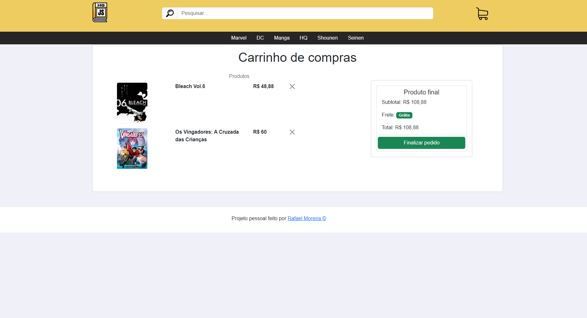

# ENGLISH

README em portugês abaixo deste

## This is a personal project for my portfolio

#### Images

#### In this project I used

- vite
- react
- react-dom
- react-router-dom
- javascript
- bootstrap
- sass
- html

#### Description

this is an e-commerce project of HQs and Mangas, this project has a search bar and a shopping cart. It's also a SPA(single page application) and every book has his own page to look the details, everything was made of react-bootstrap and the react-router-dom to set the routes. The project is reponsive and has a hook using local storage to make the shopping cart work.

#### How it works

first add a book, you need to create a json file named database and add the array of elements with each elements following this structure:
[{"id": "id of the book",
"title": "title of the book",
"description": "description of the book",
"fullDescription": "the description will show if you click to view the book",
"image": "image of the book",
"price": "price of the book",
"categories": ["categorie 1 (manga or HQ)", "categorie 2 (the book franchise)", "categorie 3 (genre or company of the book)"]},]

after that all the stuff will work so you can search, look for the own book page and add to the shopping cart or remove of the shopping cart.

# PORTUGUÊS

README in english above

## Esse é um projeto pessoal para o meu portfolio

#### Imagens

#### Neste projeto eu usei

- vite
- react
- react-dom
- react-router-dom
- javascript
- bootstrap
- sass
- html

#### Descrição

este é um projeto de e-commerce de HQs e Mangás, este projeto possui uma barra de busca e um carrinho de compras. Também é uma SPA (single page application) e cada livro tem sua própria página para ver os seus detalhes, tudo foi feito no react-bootstrap e usando o react-router-dom para definir as rotas. O projeto é responsivo e possui um hook utilizando local storage para fazer o carrinho de compras funcionar.

#### Como funciona

primeiro adicione um livro, crie um arquivo json chamado database e adicione um array de elementos sendo que cada elemento siga essa estrutura:
[{"id": "id do livro",
"title": "título do livro",
"description": "descrição do livro",
"fullDescription": "a descrição que será mostrada na página de detalhes do livro",
"price": "preço do livro",
"categories": ["categoria 1 (manga ou HQ)", "categoria 2 (franquia do livro)", "categoria 3 (gênero ou compania do livro)"]},]

após isso tudo irá funcionar normalmente, então você pode pesquisar pelo livro, ver sua página de detalhes e adicioná-la ou removê-la do carrinho.
